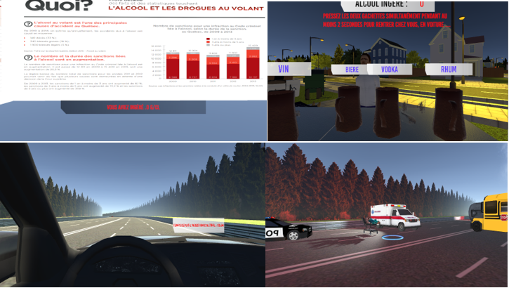

# VirtuaDrink - Développé pour le HTC Vive
- Projet pour faire prendre conscience des risque sur la prise d'alcool au volant.
- Projet réalisé pour le cours de 3D VR à l'UQAC

## Features développées par moi même
- Première scène où l'on consomme de l'acool : 
	- Ensemble des intéractions VR avec vos manettes Vive, comme la mécanique pour consommer de l'acool qui réalise un retour haptique lorsque vous êtes effectivement entrain de boire etc ...
	- Intégralité de l'UI
	- Système de calcul de quantité d'alcool
- Seconde scène ou l'on conduit sa voiture :
	- Mise à jour du shader toutes les frames pour qu'à 30 secondes on ressente les effets maximum de notre consommation d'alcool sur la scène précédente.
  	- Input utilisateur pour faire avancer la voiture
	- UI indiquant le temps qui défile, ici une seconde = une minute pour qu'en 30 seconde l'utilisateur resente les effets maximum de sa quantité d'alcool inégéré.
- Scène poste accidente - Entièrement réaliseé par moi même :
	- Téléportation via Manette vive
	- Système d'évènements qui se lancent près des cercles bleues au sol, il suffit de regarder l'évènement, qui sont assez évident à trouver, et un script se lance pour tout déclencher à la fin de cet évènement un panel s'affiche et décrit les conséquences de vos actes sur cette/ces victimes. Les évènements peuvent utiliser des retours haptiques.
	- Lorsque le pannel s'affiche à la fin d'un évènement vous pouvez intéragir avec via vos manettes Vive, il y a un système de zoom et de coloration ainsi qu'un retour haptique. 
  - Le dernier évènement prés des médecins vous enmènent à la scène suivante.
- Scène Bilan avec les statistiques offciel du Québec - Entièrement réalisée par moi même :
  - Affichage des statistiques sur 4 murs.
  - Rappel de la consommation ingérée via l'UI  afin de se situer dans les statistiques
## Comment jouer ?

Pour le moment il faut télécharger le projet et le tester sous Unity, nous sommes entrain de régler les problèmes d'UI lié au build.
 
## Controles
- Les contrôles sur chaque scène sont assez intuitifs mais tout de même une petite explication s'impose : 
  - Sur la première scène, vous pouvez saisir les choppes contenant différents alcool devant vous via vos manettes vive en réstant appuyer sur le Hair Trigger, autrement dit la gachette ! 
  - Pour passer à la seconde scène, comme indiqué sur l'écran, vous devez maintenir les deux gachettes enfoncées pendant au moins 2 secondes
  - Lors de la scène ou vous conduisez la voiture appuyez sur le Touchpad de la manette droite pour avancer et celui de la manette gauche pour reculer
  - La prise en main du volant se fait via les gachettes
  - Lors de la scène post accident, utiliser le touchpad de la manette droite pour vous téléporter et intéragir avec les différents panel des différentes victimes.
	
## Conclusion
Premier projet VR pour moi. Cela m'a appris à prendre en main la librairie Steam VR sous Unity ainsi que de mettre en pratique ce que j'avais appris en cours de 3D/VR

# Authors

* [Sacha Vanleene](https://github.com/SachaVanleene) - Programmer
* [Matthieu Le Boucher ](https://github.com/Meight) - Programmer
